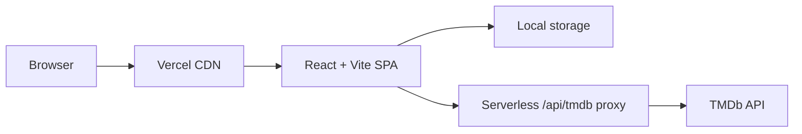

# FlickMuse — Movie Discovery, Trailers & Cast

[](https://github.com/Mohataseem89/FilmWick-Movie_Explorer_Web_App/actions/workflows/ci.yml)

FlickMuse is a movie and TV discovery application built with React and TMDb. Explore popular, trending, upcoming, and top-rated titles; use shareable filters; watch trailers; browse cast and crew; check India streaming availability when TMDb provides it; and save a personal watchlist.

[Live demo](https://flickmuse.mohataseem.com/) · [Source code](https://github.com/Mohataseem89/FilmWick-Movie_Explorer_Web_App)


## Highlights

- Discover trending, now-playing, upcoming, popular, and top-rated movies, plus popular TV shows.
- Search movies and TV shows by title, explore cast and crew, watch trailers, and browse related titles.
- Filter by genre, year, rating, and sort order with shareable URLs.
- Maintain a local, persistent watchlist with defensive browser-storage handling and a one-time legacy key migration.
- Use responsive images, route-level code splitting, session response caching, loading/error states, keyboard navigation, live result announcements, and reduced-motion support.

## Architecture



Movie data is requested through `api/tmdb.js`, a Vercel serverless proxy. The TMDb API key stays in the server environment as `API_KEY`; it is not bundled into the browser. Watchlist and search-history data remain on the user’s device, so the app does not require accounts or a database.

## Technology

| Technology | Purpose |
| --- | --- |
| React 19 + React Router | UI, routes, and URL-driven state |
| Vite 7 | Development and production bundling |
| Tailwind CSS 4 | Responsive UI styling |
| Vercel Functions | Protected TMDb API proxy |
| TMDb API | Movie, person, image, and video data |
| Vitest + React Testing Library + Node test runner | Component, interaction, accessibility, and utility checks |
| ESLint | Code-quality checks |

## Run locally

Requirements: Node.js 20+ and a TMDb API key.

```bash
git clone https://github.com/Mohataseem89/FilmWick-Movie_Explorer_Web_App.git
cd FilmWick-Movie_Explorer_Web_App
npm install
cp .env.example .env
npm run dev
```

Add this value to `.env`:

```env
API_KEY=your_tmdb_api_key
```

Never commit `.env`. In Vercel, add the same `API_KEY` environment variable for the environments you deploy to.

## Commands

| Command | Purpose |
| --- | --- |
| `npm run dev` | Start local development |
| `npm run lint` | Run ESLint |
| `npm run test` | Run utility, contrast, and component tests |
| `npm run test:utils` | Run storage and contrast tests |
| `npm run test:components` | Run React component tests in JSDOM |
| `npm run build` | Create a production build |
| `npm run check` | Run lint, tests, and build |

## Project map

```text
api/tmdb.js       # Vercel serverless TMDb proxy
src/api/          # Browser TMDb client and request helpers
src/components/   # Reusable UI components
src/pages/        # Route pages
src/hooks/        # Metadata and watchlist hooks
src/utils/        # Browser-storage and domain helpers
public/           # Favicons, social image, manifest, robots, sitemap
tests/            # Regression tests
docs/             # Architecture, testing, performance, and screenshot notes
```


## Deployment

Vercel uses `vercel.json` for SPA rewrites, caching, and security headers. Set `API_KEY` in Vercel before deployment. The production domain is `https://flickmuse.mohataseem.com/`.

## Attribution

This product uses the TMDB API but is not endorsed or certified by TMDB. Movie information and images are provided by [The Movie Database](https://www.themoviedb.org/).

## Author

Mohataseem Khan · [LinkedIn](https://www.linkedin.com/in/mohataseem-khan/) · [GitHub](https://github.com/Mohataseem89)


> Made with ❤️ for movie lovers.
